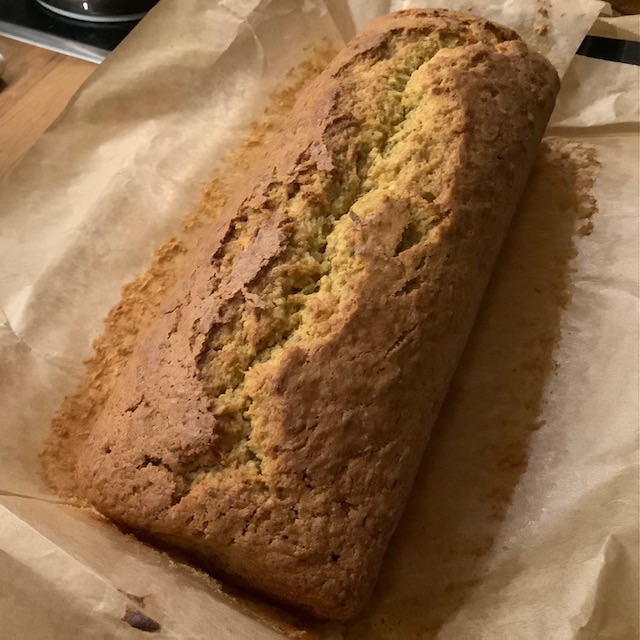

## Kürbiskuchen



**Zutaten:**
```
300 g Hokaido-Kürbis (ohne Kerne)
100 g Butter
200 g Zucker
100 g Mandeln
250 g Mehl
  3 Eier
  1 Pck. Backpulver
  1 Pck. Vanillezucker
  1 TL Zimt
```

**Zubereitung:**  

1. Den Kürbis teilen, entkernen und fein raspeln. 
3. Alle Zutaten in eine Schüssel geben und mit dem Mixer vermengen. 
4. Eine Kastenform einfetten und den Teig einfüllen. 

> Bei 180°C ca. 50-60 Minuten backen. Stäbchenprobe machen.


Quelle: Nach einem Rezept von saskiarundumdieuhr.blogspot.com
