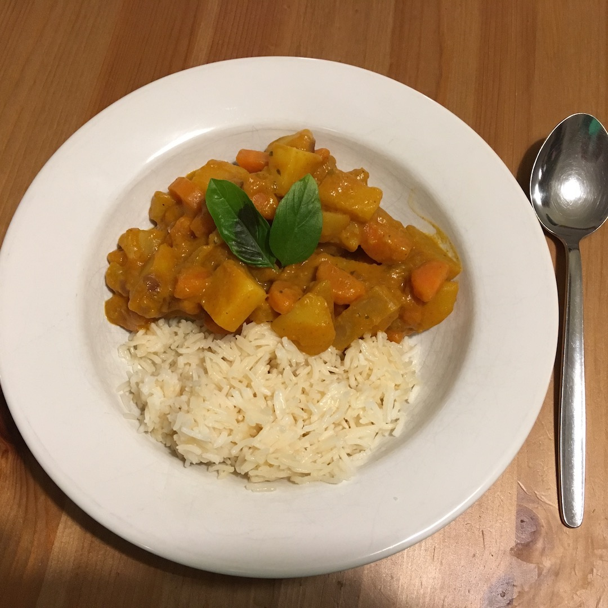
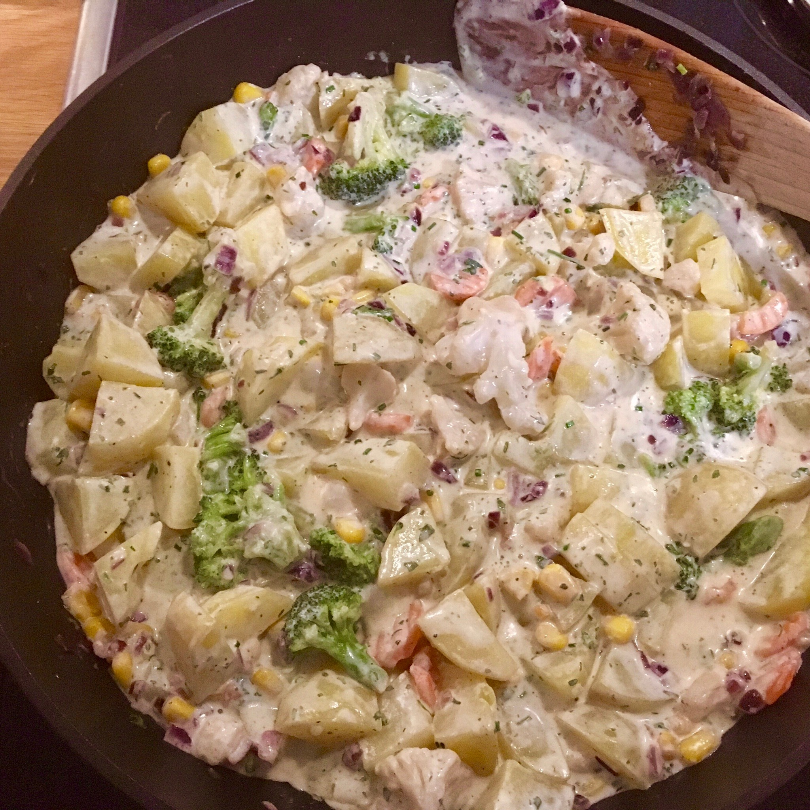
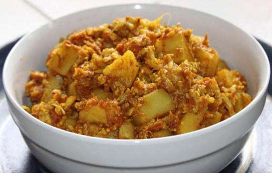
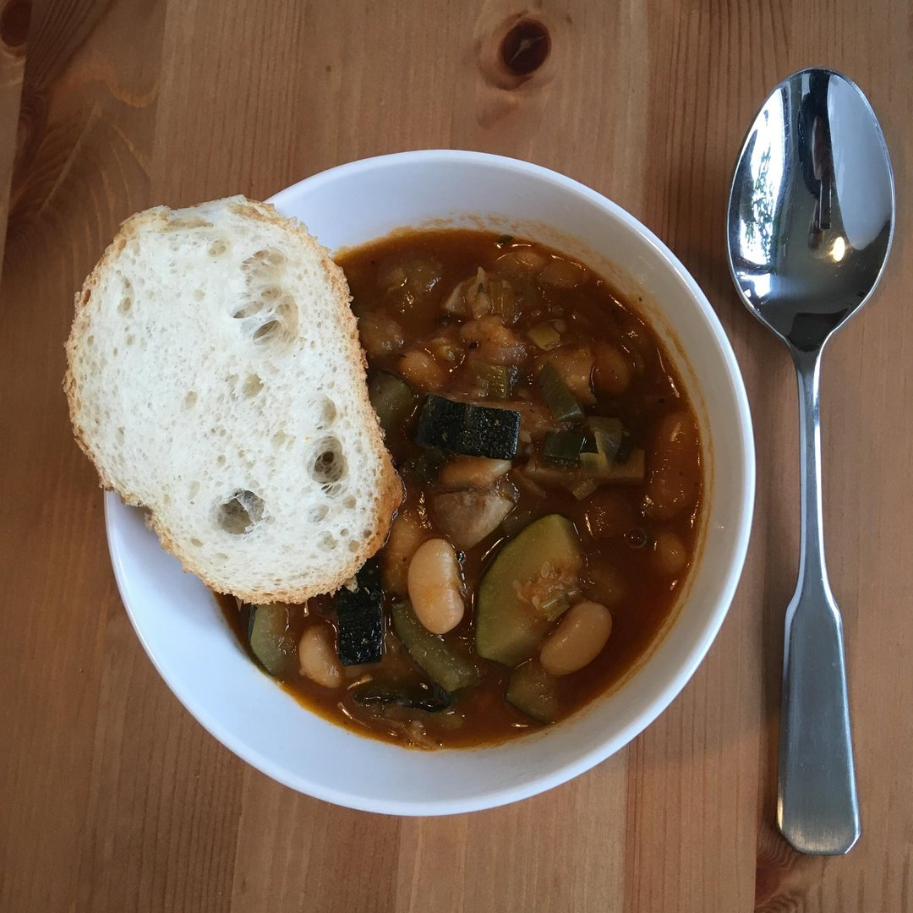
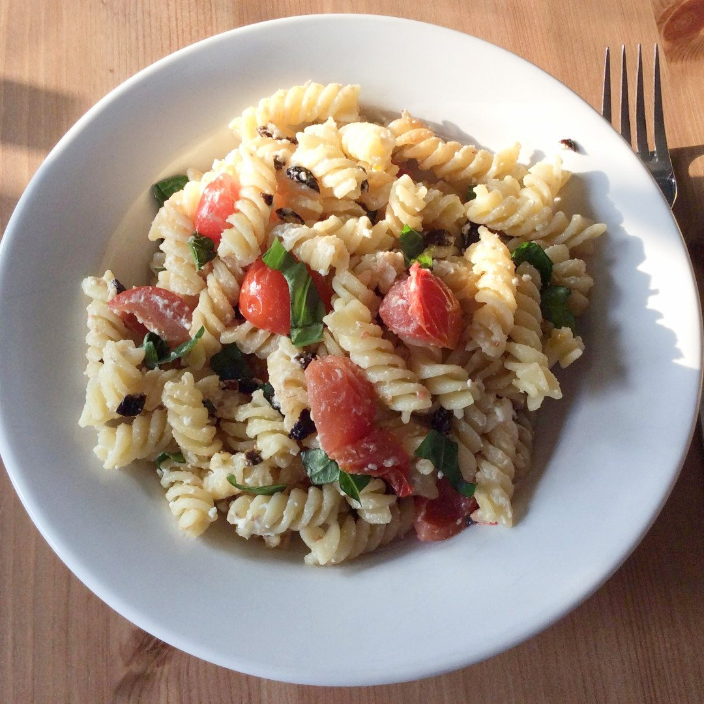
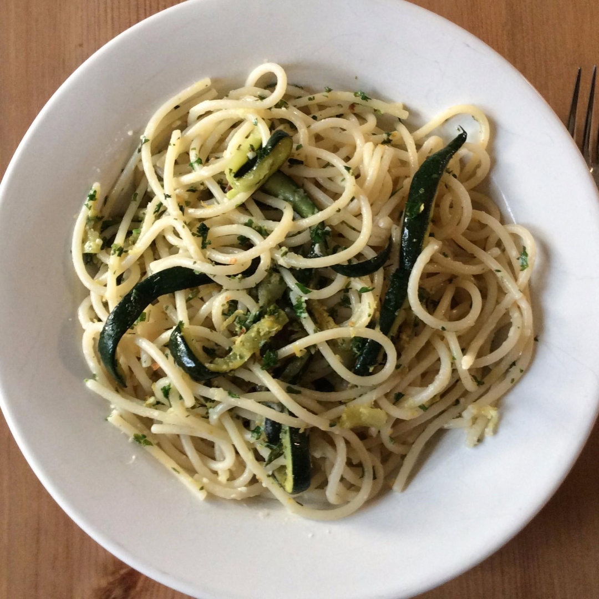

Hauptgerichte
=============

1. [Maafe ohne Fleisch](#maafe-ohne-fleisch)
1. [Kaiserpfanne](#kaiserpfanne)
2. [Aloo Gobi Tomater](#aloo-gobi-tomater)
3. [Bohneneintopf Languedoc](#bohneneintopf-languedoc)
4. [Pasta mit Feta, Oliven und Tomaten](#pasta-mit-feta-oliven-und-tomaten)
5. [Eier in Senfsoße](#eier-in-senfsoße)
6. [Zucchini-Zitrone Nudeln](#zucchini-zitrone-nudeln)


   <p align="center"><br><br><br>____<br><br></p>  

Maafe ohne Fleisch
------------------

<p>Maafe (franz. Maf&eacute;) ist ein westafrikanisches Gericht und bedeutet w&ouml;rtlich &uuml;bersetzt &quot;Erdnussbutterso&szlig;e&quot;. Es ist ein im Senegal und Gambia beliebtes Gericht und existiert in vielen Variationen.</p>



**Zutaten** für 4 Personen

```
250 g  Kohlrabi
250 g  Karotte(n)
400 g  Kartoffel(n)
100 g  Zwiebel(n)
  2    Knoblauchzehe(n)
  2 EL Olivenöl
  1 EL Currypulver
350 ml Gemüsebrühe
  2 EL Erdnussbutter
  1 EL Tomatenmark
  2 EL Sojasauce
       Salz und Pfeffer
       Chilipulver
```

**Zubereitung**

   1. Das Gemüse schälen. Kohlrabi, Karotten und Kartoffeln in mundgerechte Stücke schneiden,
      Zwiebeln würfeln, Knoblauch fein hacken.
   2. In einem großen Topf das Öl erhitzen und das Currypulver kurz anbraten, dann Zwiebeln und 
      Knoblauch zugeben und glasig dünsten. Anschließend das Gemüse und die Kartoffeln 
      zugeben und kurz mit anbraten. Erdnussbutter, Tomatenmark, Sojasoße zugeben und mit 
      Gemüsebrühe ablöschen. Kurz aufkochen lassen, zudecken und bei kleiner 
      Hitze 20 - 30 Min. kochen, bis das Gemüse gar, aber noch bissfest ist. Ab und zu 
      umrühren. Zum Schluss mit Salz, Pfeffer und Chili abschmecken.

  Dazu wird meist Reis gegessen. Fladenbrot passt ebenfalls gut dazu. 
  In ein authentisches Maf&eacute; kommt wesentlich mehr Erdnussbutter als hier verwendet wird.
  
> Quelle: Nach dem Rezept &quot;Vegetarisches Maf&eacute;&quot; von honig-tine

#vegan


   <p align="center"><br><br><br>＊　＊　＊<br><br></p>  

       
Kaiserpfanne
------------



**Zutaten** für 4 Personen

```
700 g  Kartoffeln (keine mehligen)
350 g  Kaisergemüse (tiefgefroren)
100 g  Mais (Dose oder TK-Ware)
 20 g  Petersilie (gehackt, ggf. TK-Ware) 
150 ml Gemüsebrühe
200 g  Schmand
       Salz, Pfeffer, 
       Muskat, Paprika (edelsüß)
  1 große Gemüsezwiebel (oder 5 kleine)
  2 EL Raps- oder Olivenöl
```

**Zubereitung**

1. Die Kartoffeln schälen, vierteln und in Salzwasser kochen. Die Kartoffeln nicht zu weich kochen, da sie noch in die Bratpfanne kommen. Ich selbst ziehe es vor die Kartoffeln ohne Salz in der Mikrowelle zu garen. So kann man die Kartoffeln kleiner schneiden ohne Gefahr zu laufen, dass sie beim Kochen auslaugen.

2. Das gefrorene Kaisergemüse in eine feuerfeste Glasschüssel geben und in der Mikrowelle al dente garen. Wenn TK-Mais verwendet wird diesen mitkochen.

3. Die Zwiebel schälen, in Würfel schneiden und in einer hochwandigen Pfanne (oder großen Topf) mit dem Öl glasig dünsten.
    
4. Das al dente gegarte Gemüse zu den glasigen Zwiebeln in die Pfanne geben. Die vorgegarten Kartoffeln abgießen, und vorsichtig untermischen und alles auf kleiner Stufe schmoren lassen. 

5. Mit Salz, Pfeffer, Muskat und Paprika würzen. Wenn Mais aus der Dose verwendet wird, diesen abgießen und ebenfalls in die Pfanne geben. 

6. Petersilie waschen und fein hacken bzw. auftauen lassen.

7. Die Gemüsebrühe mit dem Schmand und der gehackten Petersilie zu einer Sauce vermischen.

8. Die Sauce über die Pfanne gießen und kurz aufkochen lassen.

> Quelle: Abwandlung des Rezeptes &bdquo;Vegetarische Bauernpfanne&ldquo; von Sven Bach

#lactovegetarisch


   <p align="center"><br><br><br>＊　＊　＊<br><br></p>  


Aloo Gobi Tomater
-----------------



**Zutaten**

```
  1 kleiner Blumenkohl
  4 Kartoffeln
400 g Tomaten
    (z.B. Pizzatomaten aus der Dose)
  2 EL  Olivenöl
  1 gestr. EL Kreuzkümmel (Cumin)
  1 gestr. EL Garam Masala
  1 gestr. TL Korianderpulver
  1 Prise Muskatnuss
  1 gestr. TL Kurkuma (Gelbwurz)
  1 TL frischer Ingwer (gerieben)
    Salz
dazu Basmati-Reis
```

**Zubereitung**

Kartoffeln schälen. Wenn man gute Frühkartoffeln hat, diese unter Wasser sauber bürsten. In 2 bis 3 cm große Stücke schneiden. Blumenkohl waschen und Röschen in gleicher Größe abtrennen. Wenn man frische Tomaten hat, ebenfalls waschen und in Stücke schneiden.

Öl in einer tiefen Pfanne (oder flachem Topf) erhitzen und alle Gewürze (außer Muskat) darin unter Rühren anrösten bis es duftet.

Tomaten dazugeben, mit Muskat und Salz würzen und gut vermischen. Kartoffel und Blumenkohl dazugeben, umrühren. Mit Deckel köcheln lassen bis alles gar ist. Gelegentlich umrühren.

> Quelle: Originalrezept siehe https://goo.gl/eAAMmP


   <p align="center"><br><br><br>＊　＊　＊<br><br></p>  


Bohneneintopf Languedoc
-----------------------

(franz. Cassoulet des légumes)


   
**Zutaten für 3 Personen**

```
250 g  getrocknete Bohnen
0,5 l  Gemüsebrühe (Bouillon)
  1 Lorbeerblatt
  1 kleiner Zweig Rosmarin
  1 TL Bohnenkraut
150 g Champignons  
  1 kleine Zucchini
370 g  passierte Tomaten (oder 
    zerkleinerte Dosentomaten)
  1 Stange Lauch
  1 Zwiebeln 
100 g  schwarze entkernte Oliven
  2 Knoblauchzehen
    Salz, Pfeffer
  6 EL Olivenöl
    mit Baguette servieren 
```

**Variationen**

 - 5 mittlere Kartoffeln mitkochen und ohne Baguette servieren,  
 - Pilze der Saison statt Champignons oder Staudensellerie statt Pilze,  
 - Schalotten statt Zwiebeln  
 
**Zubereitung**

1. Bohnen über Nacht in Wasser einweichen.
2. Am nächsten Tag Einweichwasser abgiessen. Bohnen in einen großen Topf geben und mit Gemüsebrühe knapp bedecken.
3. Lorbeerblatt, Bohnenkraut und Rosmarinzweig dazu geben, kurz aufkochen und bei kleiner Flamme zugedeckt ca. 1 Stunde garen lassen.
4. ggf. Kartoffeln Schälen und in 1 cm großen Würfel schneiden
5. ggf. Staudensellerie waschen, Grün hacken, Stangen von Fäden befreien und in 5mm dicke Scheiben schneiden.
6. Zucchini in 1 cm dicke Scheiben schneiden, viertelen, beiseite stellen.
7. Lauch waschen, putzen und in Scheiben schneiden.
8. Rosmarinzweig und Lorbeerblatt entfernen.
9. Das restliche Gemüse entsprechend der Gardauer hinzufügen:
   1. ggf. Kartoffeln (falls Variation)
   2. Lauch, Zwiebel (fein gewürfelt), Oliven (geviertelt) und ggf. Staudensellerie
   3. Zucchini und Pilze (geviertelt)
   4. Tomaten
   
   Wasser zugeben bis das Gemüse bedeckt ist. Zugedeckt auf kleiner Hitze garen. 

Nach einer Rezeptidee von [Delinat.com](https://www.delinat.com/rezept.html?DStextrezept7=183)


   <p align="center"><br><br><br>＊　＊　＊<br><br></p>  


Pasta mit Feta, Oliven und Tomaten
----------------------------------



**Zutaten** für 2 Portionen

```
333 g     Nudeln (Fusilli)
200 g     Kirschtomaten
 12 Stück schwarze Oliven (ohne Kern) 
150 g     Fetakäse 
          (aus Ziegen- oder Schafsmilch)
  3 EL    Olivenöl 
  2 Zehen Knoblauch 
          Basilikum (frisch gehackt)
          Pfeffer
```

**Zubereitung**

Die Nudeln in Salzwasser kochen. In der Zwischenzeit Olivenöl in einer großer Pfanne (oder großem Topf) erhitzen und die in Scheiben geschnittenen Knoblauchzehen darin anbraten. Tomaten, Feta und Oliven würfeln, bzw. halbieren. Nudeln abtropfen lassen und in die Pfanne geben, umrühren und alle Zutaten dazugeben, vermischen und mit Peffer abschmecken. Kurz durchziehen lassen, so dass alle Zutaten erwärmt sind.

> Quelle: Originalrezept war im Kalender 2016 des Combi-Markt


   <p align="center"><br><br><br>＊　＊　＊<br><br></p>  


Eier in Senfsoße
----------------

**Zutaten** für 3 Personen

```
  8    Eier
 40 g  Butter
 50 g  Mehl
250 ml Gemüsebrühe
250 ml Sahne (oder Milch)
       Kartoffeln nach belieben
  4 EL mittelscharfer Senf
       Pfeffer, Salz, Zucker, Muskat
       Schnittlauch oder Frühlingszwiebeln
```

### Zubereitung

1. _Kartoffeln_ aufsetzen
1. _Eier_ hartkochen
1. _Butter_ zerlassen und mit dem _Mehl_ zu einer Mehlschwitze verrühren.
1. _Brühe_ unter Rühren dazugeben.
1. _Sahne_ mit dem _Senf_ vermischen und dazugeben
1. mit _Pfeffer, Salz, Zucker, Muskat_ abschmecken
1. gekochte Eier halbieren und in der Soße aufwähren
1. mit dem gehackten _Schnittlauch_ auf Pell- oder Salzkartoffeln servieren

> Quelle: Reni


   <p align="center"><br><br><br>＊　＊　＊<br><br></p>  


Zucchini-Zitrone-Nudeln
-----------------------

   

**Zutaten** für 4 Portionen

```
500 g Nudeln (Makkaroni)
500 g Zucchini
  2 EL Olivenöl
  1 Zitrone, unbehandelt, Saft  
    und abgeriebene Schale davon
150 g Parmesan oder Pecorino,  
    gerieben
  2 Zehen Knoblauch, gehackt 
    oder gepresst
  1 Bund Petersilie
    Salz, Pfeffer
```

**Zubereitung**

Die Nudeln nach Packungsanweisung bissfest kochen. Die Zucchini in lange, dünne, ca. 1 cm breite Streifen schneiden und in einer großen Pfanne im heißen Öl anbraten, bis sie gebräunt sind. Abgeriebene Zitronenschale, gehackten Knoblauch und dann die gehackte Petersilie zugeben, kurz weiter braten, mit dem Zitronensaft ablöschen. Die Zucchini unter die abgetropften Nudeln mischen. Den Parmesan bzw. den Pecorino unterrühren und mit Pfeffer und evtl. Salz abschmecken.

∎  
