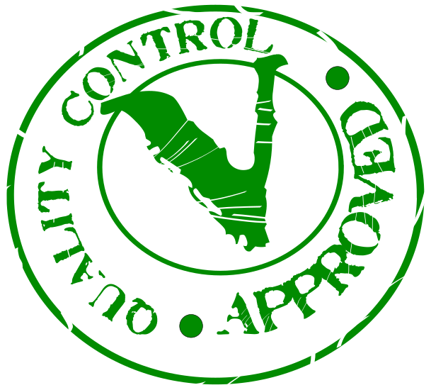

Bunter Nudelauflauf
-------------------



**Zutaten** für 4 Personen

```
500 g  Nudeln (Trockenprodukt, z.B. Mini-Fusilli)
  6    vegetarische Wiener-Würstchen
  1    rote Paprika, fein gewürfelt 
300 g  TK-Erbsen 
  1 Dose Mais (ca. 300 g) 
180 g  Gouda-Käse (zum Überbacken) 
```

**Soße**
```
   1 EL Butter
   2 EL Mehl
 700 ml Gemüsebrühe
 400 ml fettreduzierte Sahne (z.B. 7% Fett) 
        (oder 200 ml Sahne + 200ml Wasser)
   2    Lorbeerblätter 
   1 TL Paprikapulver, edelsüß
 1/2 TL Knoblauchgranulat (oder eine frische Zehe)
 1,5 TL Salz 
 1/2 TL weißen oder schwarzen Pfeffer
 1,5 TL Oregano
```

_**Anmerkung:** Je nach Nudelsorte muss die Menge der Soße angepasst werden. Die Nudeln sollen mit der Soße bedeckt sein._

**Zubereitung** 

1. Eine große Auflaufform buttern und die ungekochten Nudeln hineingeben.
2. Paprika und Würstchen klein schneiden und zusammen mit den noch kalten Erbsen in die Form geben.
4. Den Mais abtropfen lassen, dazugeben und gut vermengen.
5. Den Backofen auf 175° C vorheizen.

**Soße zubereiten**

1. Aus Butter und Mehl eine Mehlschwitze herstellen.
2. Die 700ml Brühe nach und nach dazugeben, dabei immer umrühren.
3. Sahne dazugeben und weiterrühren.
4. Die Gewürzen dazugeben und Soße kurz aufkochen lassen.
6. Die Soße gleichmäßig in der Auflaufform verteilen, evtl. umrühren.<br>Wichtig: Die Nudelmasse sollte von Soße bedeckt sein!
7. Den geriebenen Käse auf die Masse geben.

> Im Ofen bei 175° C Umluft ca. 20-30 Minuten backen.  

Wenn vorhanden den Deckel auf die Auflaufform tun.  
_Die Backzeit hängt von den Nudeln ab, am besten schauen wann es kocht und dann die bei den Nudeln abgegebene Kochzeit abwarten._

____
_Quelle: Rezeptidee nach Kikis Kitchen_  
#lactovegetarisch
