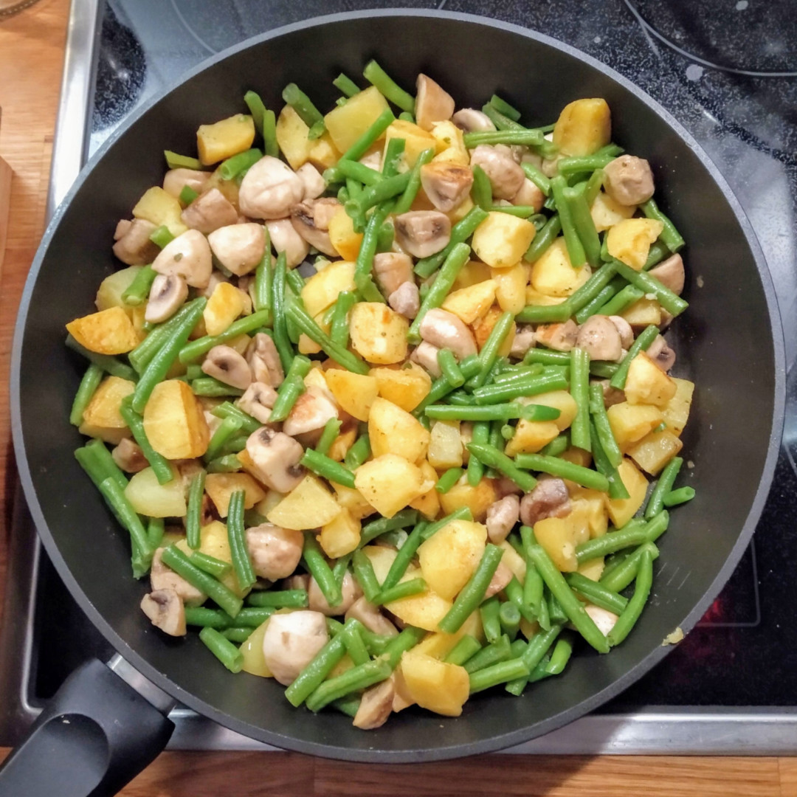

Kartoffel-Bohnen-Champignon-Pfanne  
----------------------------------

für 3-4 Personen



**Zutaten**

```
600 g  Kartoffeln, festkochend
450 g  grüne Bohnen (1 Päckchen TK-Brechbohnen)
400 g  Champignons (frisch)
       Öl für die Pfanne
1/2 TL Knoblauchgranulat (oder eine frische Zehe)
  1 TL Salz
       Pfeffer
  1 TL Oregano (getrocknet)
```


**Zubereitung** 

1. Die Kartoffeln schälen und würfeln.
2. Die Bohnen auftauen.
3. Die Champignons putzen und in Stücke schneiden.
4. Nun die Kartoffelstücke in der Pfanne anbraten. 
5. Die (aufgetauten) Bohnen in mundgerechte Stücke schneiden und dazugeben.
6. Beides weiter braten,  danach die Pilze dazugeben und weiterbraten. 
7. Mit Knoblauch, Salz, Pfeffer und Kräutern würzen.

Quelle: Nach einer Idee von [daElli65 auf Chefkoch](https://www.chefkoch.de/rezepte/2566081401619369/Kartoffel-Bohnen-Champignon-Pfanne.html)

#vegan docs gh
