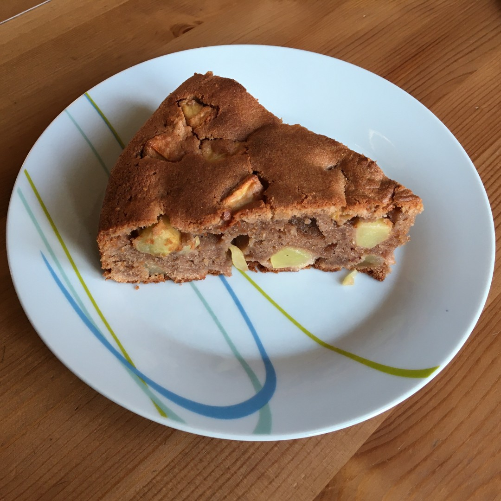

Spanischer Apfelkuchen
-----------------------



**Zutaten**

```
4-5    &Auml;pfel
  3 EL Rum
  1 Pck. Vanillezucker
200 g  Butter
200 g  Zucker
  4    Eier
200 g  Mehl (Type 550)
125 g  Mandeln (gemahlen)
  2 EL Kakaopulver
  1 TL Zimt
  1 TL Backpulver
```


<div class="ANMERKUNG" style="float:left;">
  <p>
    <em
      ><strong>Anmerkung:</strong> Mit Kakaopulver ist kein Getr&auml;nkepulver
      gemeint (welches bis zu 80% aus Zucker besteht). Wenn man
      Kakao-Getr&auml;nkepulver verwenden will, sollte man etwa 8 EL nehmen und
      die Zuckermenge entsprechend reduzieren.</em
    >
  </p>
</div>
<div class="ZUBEREITUNG" style="float:left;">
  <p><strong>Zubereitung</strong></p>
  <ol>
    <li>In einer Schale den Rum mit dem Vanillezucker verr&uuml;hren.</li>
    <li>
      Die &Auml;pfel sch&auml;len, Kerngeh&auml;use entfernen und w&uuml;rfeln.
    </li>
    <li>
      Die W&uuml;rfel in den Schale mit dem Rum geben und ca. 1 Stunde lang
      ziehen lassen.
    </li>
    <li>Die Butter mit dem Zucker schaumig r&uuml;hren.</li>
    <li>Die Eier dazu geben und unterr&uuml;hren.</li>
    <li>Mandel, Kakao und Zimt unterr&uuml;hren.</li>
    <li>Danach das Mehl und das Backpulver unter mixen.</li>
    <li>Zuletzt die Apfelw&uuml;rfel unterheben.</li>
    <li>Eine Springform fetten und den Teig hineingeben.</li>
  </ol>
</div>
<p style="clear:left;">Bei 175&deg; C Umluft, 50 bis 55 min backen.</p>
<div style="clear:left;">&nbsp;</div>
<aside style="float:right;">lr</aside>
<div>#tierisch</div>
