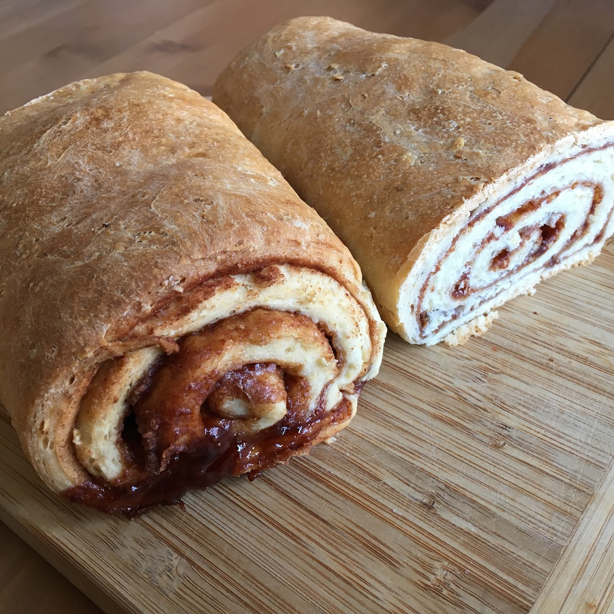

Zimtbrot
------------------



**Zutaten für den Teig**

```
  1 Pck. Trockenbackhefe
  1 TL   Salz (gestrichen)
  3 EL   Zucker
 40 g    Haferflocken
485 g    Mehl
 60 ml   Milch (handwarm)
 85 g    Butter (warm)
240 ml   Wasser (handwarm)
Zutaten für die Füllung
```
**Zutaten für die Füllung**

```
 50 g    Zucker
1 1/2 TL   Zimt (gemahlen)
  2 TL   Mehl
  
```

**Zubereitung**

1. Trockenbackhefe, Salz, Zucker und Haferflocken mit dem Mehl mischen.
2. Milch und Butter in der Mikrowelle erwärmen und schrittweise mit dem Wasser zu einem elastischen Teig verkneten. Benötige Wassermenge ggf. anpassen, da diese variiert (je nach Haferflockensorte). 
3. An einem warmen Ort gehen lassen bis sich das Volumen verdoppelt hat.
4. Eine lange Kastenform (oder 2 kleine) mit Backpapier auskleiden.
5. Für die Füllung Zucker, Zimt und 2 TL Mehl in einem Schälchen verrühren. 
6. Wenn der Teig genügend aufgegangen ist, diesen nochmal durchkneten.
7. Teig auf einer bemehlten Arbeitsfläche oder Backmatte mit einem Nudelholz auf eine Größe von etwa 20 x 50 cm ausrollen.
8. Den Teig mit der Füllung bestreuen.
9. Den Teig von der schmalen Seite her aufrollen und mit der Naht nach unten in die ausgekleidete Kastenform legen.
10. Nochmal 15 min gehen lassen. Während dessen Backofen auf 180° C vorheizen.
11. Bei Umluft 35 bis 45 Minuten goldbraun backen.

Mit Butter zum Frühstück oder Kaffee servieren.

<div align="right">#nicht-vegan</div>

> Quelle: Frei nach einem Rezept von Chefkoch/Pumpkin-Pie

