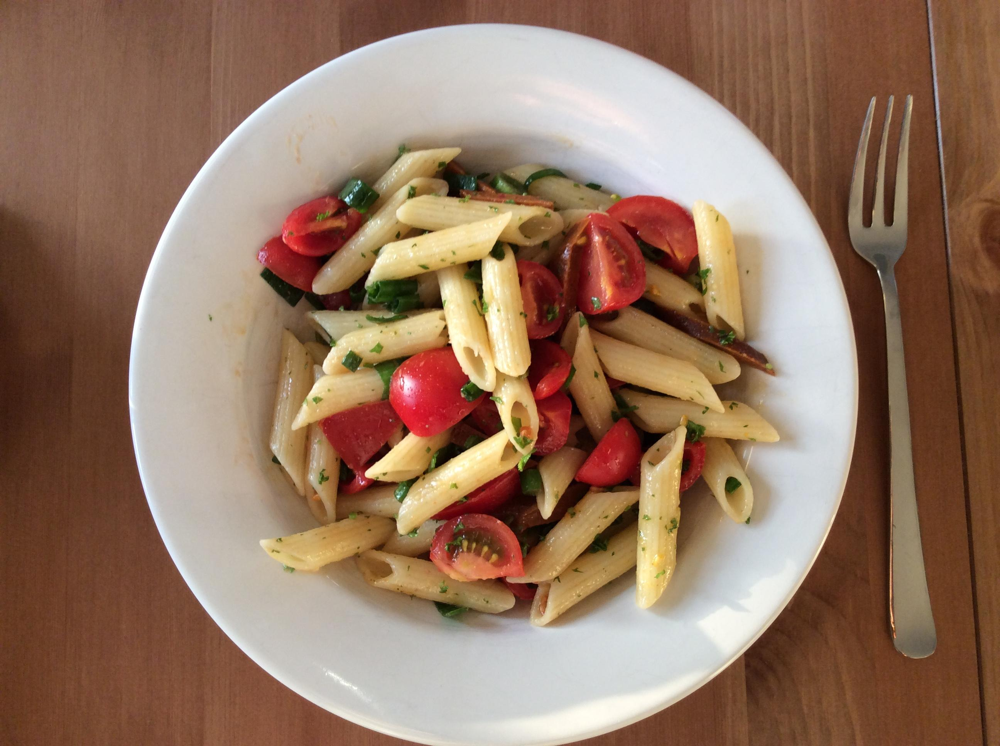

Salate
======

1. [Herzhafter Nudelsalat](#herzhafter-nudelsalat) &nbsp; __*neu*__	
1. [Zucchini-Champignonsalat](#zucchini-champignonsalat)
1. [Kohlrabisalat mit Walnüssen](#kohlrabisalat-mit-walnüssen)
  
<div dir="rtl">∎</div>


Herzhafter Nudelsalat		
---------------------		
		
Zubereitungszeit ca. 30 Minuten, pro Portion ca. 2730 Jouie/650 Kalorien		



**Zutaten** für 4 Personen:		
		
```		
500 g  kleine Nudeln		
  3    Zwiebeln		
  8    Tomaten 		
400 g  Cabanossi (ungar. Paprikawurst) 		
 32    schw. Oliven (möglichst entsteint)		
  2    Knoblauchzehen		
  6 EL Essig		
  1 TL mittelscharfer Senf		
       schw. Pfeffer		
  8 EL Öl		
  2 EL Kapern		
  1 Bund Petersilie		
```		
		
**Zubereitung**		
		
1. Nudeln nach Anleitung kochen, abgießen. 		
2. Zwiebeln schälen, vierteln und in Scheiben schneiden. 		
3. Tomaten in Stücke schneiden. 		
4. Cabanossi in Scheiben schneiden.		
5. Schwarze Oliven halbieren und entsteinen.		
6. Knoblauch schälen und fein hacken.		
7. Essig, Senf, Salz, Pfeffer und Knoblauch verrühren.		
8. Öl unter die Salatsoße rühren.		
9. Nudeln, Zwiebeln, Tomaten, Wurst, schwarze Oliven sowie Kapern mit der Soße mischen.		
11. Nudelsalat darauf anrichten.		
12. Mit gehackter Petersilie bestreut servieren.		
		
<div dir="rtl">∎</div>


Kohlrabisalat mit Walnüssen
---------------------------

Zutaten für 2 Portionen

```
400 g Kohlrabi
  1 Apfel
 30 g Walnüsse
 50 g Joghurt (10 % Fett)
      alternativ 25 g Joghurt (3,8%) und 25 g Hüttenkäse
  1 TL Zucker
  2 EL Zitronensaft
    Salz, Pfeffer
```

Zubereitung
Kohlrabi grob raspeln, leicht einsalzen und in einem Sieb abtropfen lassen. Später Restwasser aus den Kohlrabi drücken.
Walnüsse grob zerbrechenen, ohne Fett in einer beschichteten Pfanne rösten und abkühlen lassen.
Joghurt mit Zitronensaft und Zucker verrühren, mit Salz und Pfeffer abschmecken. Apfel ebenfalls grob raspeln. 

Apfel mit Kohlrabi und Joghurt-Dressing verrühren, mit Walnüssen bestreuen. 

<div dir="rtl">∎</div>


Zucchini-Champignonsalat
------------------------

– für 4 Personen –

 * 250 g  _**Zucchini**_ waschen, stifteln,  
 * 150 g  _**Champignons**_ putzen, in Stifte schneiden,  
 * 100 g  _**Karotten**_ schälen und reiben,  
 * 1 kleine _**Zwiebel**_ würfeln.  

**Dressing**

 * 4 EL    _**Olivenöl**_ 
 * 1 Prise _**Cayennepfeffer**_,  
 * 10 Blätter _**Basilikum**_ (frisch gehackt),  
 * _**Salz**_ gut verrühren und über die gemischten Zutaten verteilen.
  
Mit ganzen _Basilikumblättern_ garnieren.

&nbsp;  
Anmerkungen:
> mit Knoblauch testen  
> mit Sesam testen  
> mit weißem Balsamico testen  

<div dir="rtl">∎</div>

